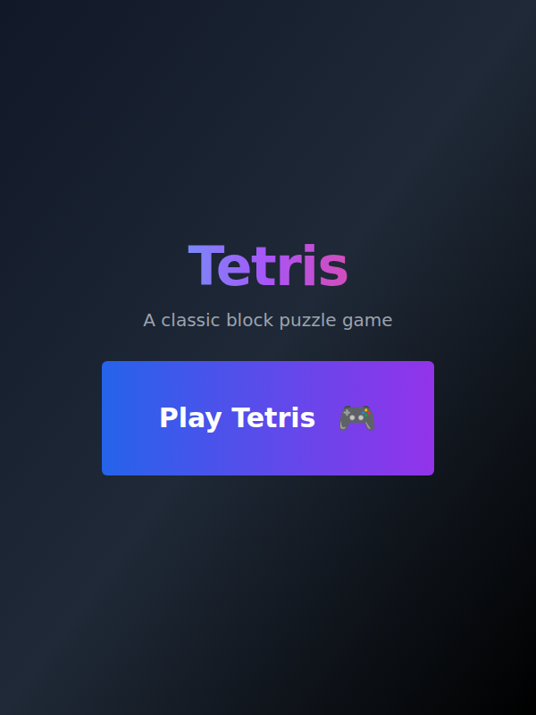

# Tetris

A classic block puzzle game, playable in the browser.

Pieces fall into a ten-by-twenty well; you slide and rotate them to complete
horizontal lines, which clear and score. The faster you clear, the faster
everything falls.



## Playing

The title screen has one button: **Play Tetris**. From there you're straight
into a game — no menus, no setup.

**Controls**

| Key | Does |
|---|---|
| ← → | Move left and right |
| ↑ | Rotate |
| ↓ | Soft drop — nudge the piece down a row |
| Space | Hard drop — slam it to the bottom and lock it |
| P | Pause and resume |

The same five moves are mirrored as on-screen buttons under the board, so the
game is playable by touch or mouse as well as by keyboard.

Alongside the board sit **Pause**, **Restart** and **Back**, a preview of the
**next** piece, and a panel tracking **score**, **lines** and **level**. Pausing
dims the board and puts a "Paused" overlay across it.

## How it plays

All seven tetrominoes are here — I, O, T, S, Z, J and L — each in its
traditional colour, from the cyan I-piece to the orange L.

**Scoring** rewards greedy clears. A single line is worth 40 points, a double
100, a triple 300, and clearing four rows at once — a tetris — is worth 1200.
Every clear is then multiplied by your current level, so the same stack is worth
far more later in a game.

**Levelling** happens every ten lines. Each new level shortens the drop interval
by 50 milliseconds, from a leisurely 800 down to a floor of 100, so the game
tightens steadily rather than spiking.

**Game over** comes when a fresh piece has nowhere to spawn. A dialog shows your
final score, lines and level, with **Play Again** to start over. Scores live in
the session only — nothing is saved between games.

## How it is put together

A React and TypeScript single-page app (Vite, Tailwind CSS), rendered as a CSS
grid of coloured cells — no canvas, no game engine, no external assets. The
board, collision detection, rotation, line clearing and scoring are plain
functions; the game loop is a single interval whose delay is the current drop
speed. It runs entirely in the browser with no backend.

## Getting started

```bash
npm install
npm run dev
```

Open the page, press Play Tetris, and use the arrow keys.
